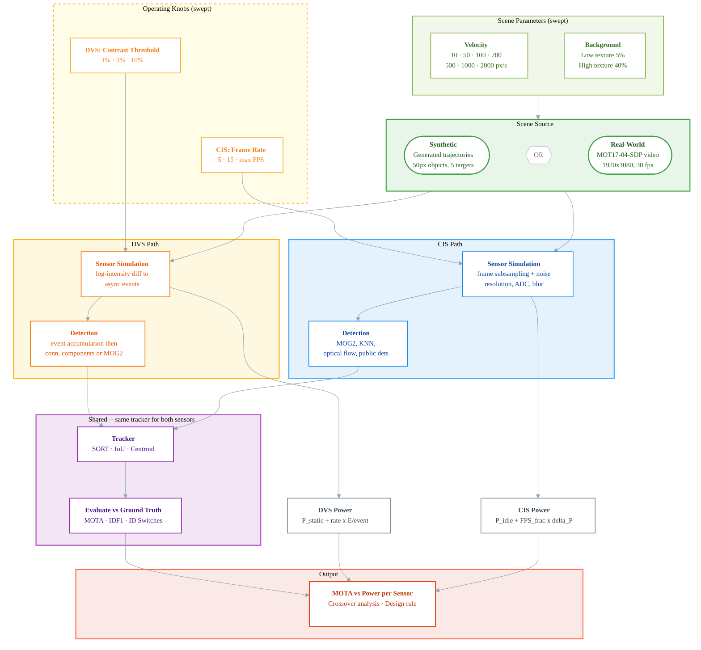

# DVS vs CIS Tracking Pipeline

```mermaid
%%{init: {'theme': 'base', 'themeVariables': { 'fontSize': '14px', 'fontFamily': 'Segoe UI, sans-serif', 'lineColor': '#90A4AE', 'primaryTextColor': '#212121' }}}%%

flowchart TD
    subgraph SCENE_PARAMS ["Scene Parameters (swept)"]
        direction LR
        V["<b>Velocity</b><br/>10 · 50 · 100 · 200<br/>500 · 1000 · 2000 px/s"]
        BG["<b>Background</b><br/>Low texture 5%<br/>High texture 40%"]
        V ~~~ BG
    end

    subgraph INPUT ["Scene Source"]
        direction LR
        S1(["<b>Synthetic</b><br/>Generated trajectories<br/>50px objects, 5 targets"])
        OR{{"OR"}}
        S2(["<b>Real-World</b><br/>MOT17-04-SDP video<br/>1920x1080, 30 fps"])
        S1 ~~~ OR ~~~ S2
    end

    subgraph KNOBS ["Operating Knobs (swept)"]
        direction LR
        DK["<b>DVS: Contrast Threshold</b><br/>1% · 3% · 10%"]
        CK["<b>CIS: Frame Rate</b><br/>5 · 15 · max FPS"]
        DK ~~~ CK
    end

    subgraph SENSORS [" "]
        direction LR
        subgraph DVS ["DVS Path"]
            D1["<b>Sensor Simulation</b><br/>log-intensity diff to<br/>async events"]
            D2["<b>Detection</b><br/>event accumulation then<br/>conn. components or MOG2"]
            D1 --> D2
        end
        subgraph CIS ["CIS Path"]
            C1["<b>Sensor Simulation</b><br/>frame subsampling + noise<br/>resolution, ADC, blur"]
            C2["<b>Detection</b><br/>MOG2, KNN,<br/>optical flow, public dets"]
            C1 --> C2
        end
    end

    subgraph TRACK ["Shared -- same tracker for both sensors"]
        T["<b>Tracker</b><br/>SORT · IoU · Centroid"]
        E["<b>Evaluate vs Ground Truth</b><br/>MOTA · IDF1 · ID Switches"]
        T --> E
    end

    subgraph POWER [" "]
        direction LR
        D3["<b>DVS Power</b><br/>P_static + rate x E/event"]
        C3["<b>CIS Power</b><br/>P_idle + FPS_frac x delta_P"]
    end

    subgraph RESULT ["Output"]
        O["<b>MOTA vs Power per Sensor</b><br/>Crossover analysis · Design rule"]
    end

    SCENE_PARAMS --> INPUT
    INPUT --> D1 & C1
    DK --> D1
    CK --> C1

    D2 & C2 --> T

    D1 --> D3
    C1 --> C3

    E --> O
    D3 & C3 --> O

    style SCENE_PARAMS fill:#F1F8E9,stroke:#7CB342,stroke-width:1.5px
    style INPUT fill:#E8F5E9,stroke:#43A047,stroke-width:2px
    style SENSORS fill:none,stroke:none
    style DVS fill:#FFF8E1,stroke:#FFB300,stroke-width:2px
    style CIS fill:#E3F2FD,stroke:#42A5F5,stroke-width:2px
    style KNOBS fill:#FFFDE7,stroke:#F9A825,stroke-width:1.5px,stroke-dasharray: 5
    style TRACK fill:#F3E5F5,stroke:#AB47BC,stroke-width:2px
    style POWER fill:none,stroke:none
    style RESULT fill:#FBE9E7,stroke:#FF7043,stroke-width:2px

    classDef paramNode fill:#FFFFFF,stroke:#7CB342,stroke-width:1.5px,color:#33691E
    classDef sourceNode fill:#FFFFFF,stroke:#43A047,stroke-width:2px,color:#1B5E20
    classDef orNode fill:#FFFFFF,stroke:#BDBDBD,stroke-width:1px,color:#757575
    classDef dvsNode fill:#FFFFFF,stroke:#EF6C00,stroke-width:1.5px,color:#E65100
    classDef cisNode fill:#FFFFFF,stroke:#1E88E5,stroke-width:1.5px,color:#0D47A1
    classDef knobNode fill:#FFFFFF,stroke:#F9A825,stroke-width:1.5px,color:#F57F17
    classDef sharedNode fill:#FFFFFF,stroke:#8E24AA,stroke-width:1.5px,color:#4A148C
    classDef powerNode fill:#FFFFFF,stroke:#78909C,stroke-width:1.5px,color:#37474F
    classDef outputNode fill:#FFFFFF,stroke:#E64A19,stroke-width:2px,color:#BF360C

    class V,BG paramNode
    class S1,S2 sourceNode
    class OR orNode
    class D1,D2 dvsNode
    class C1,C2 cisNode
    class DK,CK knobNode
    class T,E sharedNode
    class D3,C3 powerNode
    class O outputNode
```
